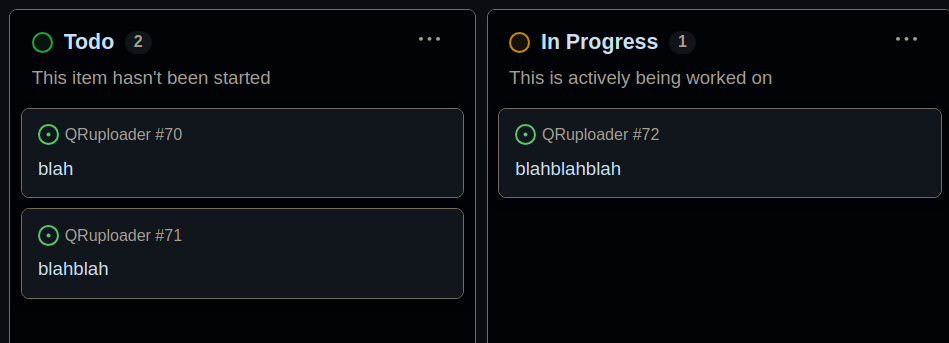
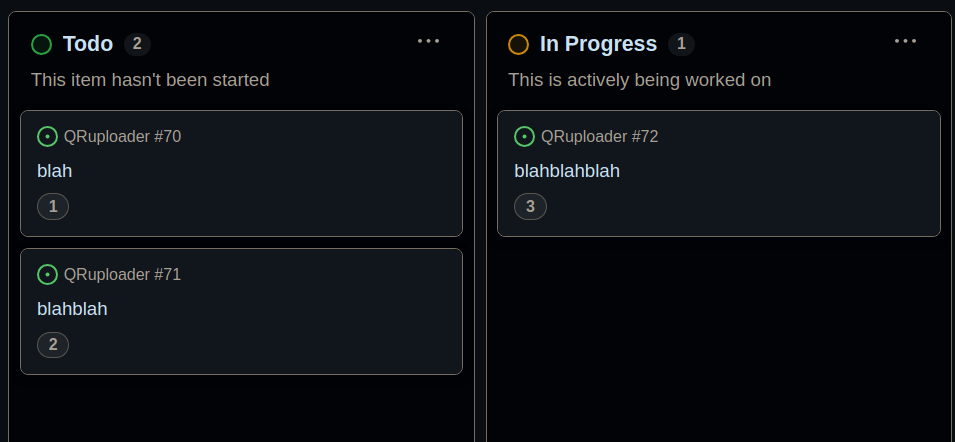

**Problem statement**: When using GitHub project board, created cards do NOT have an intrinsic number/identifier (sure, there is technically an `itemId` in the URL which consists of 8 digits, but that is not human identifiable and does not exist visually on the cards themselves). They get assigned a number once they become an _issue_ associated with a particular _repo_. This is problematic if your project involves multiple repos.

This is what it looks like _before_ this tutorial:



This is what it will look like _after_ this tutorial:



To reiterate, this is most relevant to projects with multiple repos.

## Prerequisites

- you need to know your project id, which will look like `PVT_XXXXXXXXXX`
    - run `gh project list`, optionally append `--limit 1000` if you are in a large org
- you need to know the new field id (new field being `CARD_ID` in this case), which will look like `PVTF_XXXXXXXXXX`
    - run `gh project field-list 123` where `123` is your project number which you can find in your project's URL
- you need a GitHub PAT with the following scopes: `project`, `read:org`, `repo`

## Python script


```python
#!/usr/bin/env python3

import requests
import time
import os

GITHUB_TOKEN = "ghp_XXXXXXXXXX"
PROJECT_ID = "PVT_XXXXXXXXXX"
FIELD_ID = "PVTF_XXXXXXXXXX"

def run_graphql(query, variables=None):
    """Execute a GraphQL query against GitHub API"""

    headers = {
        "Authorization": f"Bearer {GITHUB_TOKEN}",
        "Content-Type": "application/json",
    }

    payload = {"query": query}
    if variables:
        payload["variables"] = variables
    
    response = requests.post(
        "https://api.github.com/graphql",
        headers=headers,
        json=payload
    )
        
    response.raise_for_status()
    return response.json()

def get_all_project_items():
    """Get all items from the project with pagination"""

    all_items = []
    has_next_page = True
    cursor = None
    page = 1
    
    while has_next_page:
        cursor_param = f', after: "{cursor}"' if cursor else ''
        
        query = f"""
        query {{
          node(id: "{PROJECT_ID}") {{
            ... on ProjectV2 {{
              title
              items(first: 100{cursor_param}) {{
                nodes {{
                  id
                  fieldValues(first: 100) {{
                    nodes {{
                      ... on ProjectV2ItemFieldNumberValue {{
                        field {{
                          ... on ProjectV2FieldCommon {{
                            id
                          }}
                        }}
                        number
                      }}
                    }}
                  }}
                }}
                pageInfo {{
                  hasNextPage
                  endCursor
                }}
              }}
            }}
          }}
        }}
        """
        
        r = run_graphql(query)

            
        items = result["data"]["node"]["items"]["nodes"]
        all_items.extend(items)

        page_info = result["data"]["node"]["items"]["pageInfo"]
        has_next_page = page_info["hasNextPage"]
        cursor = page_info["endCursor"]
        
        print(f"Page {page}: Fetched {len(items)} items (total: {len(all_items)})")
        
        if has_next_page:
            time.sleep(0.5)  # Small delay to be nice to GitHub's API
    
    return all_items

def filter_out_items_with_id(all_items):
    """Find items without numbers and assign them"""
      
    # Find highest number and items without numbers
    highest_number = 0
    items_without_id = []
    
    for item in all_items:
        has_number = False
        for field_value in item["fieldValues"]["nodes"]:
            if (field_value and 
                field_value.get("field") and 
                field_value["field"].get("id") == FIELD_ID):
                has_number = True
                if field_value["number"] > highest_number:
                    highest_number = field_value["number"]
        
        if not has_number:
            items_without_id.append(item["id"])
    
    print(f"Found {len(all_items)} total items")
    print(f"Found {len(items_without_id)} items without numbers")
    print(f"Highest existing number: {highest_number}")
    
    return highest_number, items_without_id
    
def assign_id(highest_number, items_without_id):
    """Find a number to each id-less item"""

    for item_id in items_without_id:
        highest_number += + 1.0 # NOTE: this must be a float if you picked 'number'

        mutation = f"""
        mutation {{
          updateProjectV2ItemFieldValue(
            input: {{
              projectId: "{PROJECT_ID}"
              itemId: "{item_id}"
              fieldId: "{FIELD_ID}"
              value: {{ 
                number: {highest_number}
              }}
            }}
          ) {{
            projectV2Item {{
              id
            }}
          }}
        }}
        """
        
        r = run_graphql(mutation)
        time.sleep(0.5)  # Small delay between updates

    print(f"Finished! Assigned numbers to {len(items_without_id)} items")

def main():
    all_items = get_all_project_items()
    highest_number, filtered_items = filter_out_items_with_id(all_items)
    assign_id(highest_number, filtered_items)

if __name__ == "__main__":
    main()
```


## Final remarks

You may include this script as part of a github action that runs as frequently as you want to keep your board up to date!


